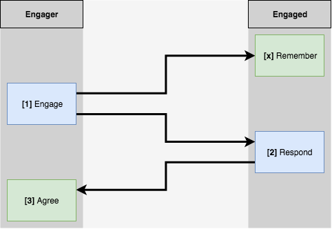

# Handshake Protocol

## Introduction

This document explains the different steps to handshake between two peers and end up with a common `AES256CTR` key.

## Pipeline

* [Engage](#engage)
* [Remember](#remember)
* [Respond](#respond)
* [Agree](#agree)

## Prerequisites

### `µPackets`

As messages will often be bigger than 508 bytes, we need to cut them into `µPackets`. Each `µPacket` has a `µHeader` containing
the `µPacket` packet id, index and size. This information is used for integrity checks and reconstitution. We are using [AES256CTR](https://www.npmjs.com/package/aes-js)
for encryption, and we have no size difference between encrypted and decrypted data.

`µPackets` with idx of 0 will have a `nanosecond_timestamp` as packet id. Those with idx > 0 will have the first 8 bytes of `keccak256(string(nanosecond_timestamp) + checksummed(master_address))` (and `master_address` has no `0x` prefix).

---

#### `µHeader`: 14 bytes

| Field Name | Field Description | Field Byte Size |
|------------|-------------------|-----------------|
| `packet_id` | Nanosecond timestamp if idx is `0`. Otherwise, `keccak256(string(nanosecond_timestamp) + checksummed(master_address))`.  | `8` |
| `index` | Index of the current `µPacket`. If `0`, contains `Header` | `4` |
| `size` | Size of current `µPacket` | `2` |
---

### Required Data

- Destination Master Address: Ethereum address of destination peer
- Destination Session Public Key: Public Key of Session KeyPair of destination peer
- An Established Connection

### Encryptions

Every `Packet` is encrypted with ECIES with the `Destination Session Public Key` of the destination peer.
All `Packet` has a `µHeader`. The `µHeader` is the only part not encrypted in all the `Packets`.
For readability, it won't be said every time.

## Steps

### [1] `engage`

First `Packet` after connection is established.

* `first_half_key` = Generate 16 random bytes as the first half of the AES256CTR key
* `first_challenge` = Generate 16 random bytes as the first challenge
* `recover_hash` = If previous key still in store, `KECCAK256(previous_key)` (optional)

The optional `recover_hash` is used when two peers disconnected and are trying to reconnect while on same session. It
allows faster handshake.

---
#### `engage`: 14 bytes (µHeader) + 236 or 268 bytes
| Field Name | Field Description | Field Byte Size |
|------------|-------------------|-----------------|
| `µHeader`| [µHeader](#uheader) | `14` |
| `type` | Packet type (here 256) | `1` |
| `master_address` | Ethereum Real Address of the user | `20` |
| `destination_address` | Ethereum Real Address of destination user | `20` |
| `session_public_key` | EC Temporary public key used for dynamic signatures | `33` |
| `session_signature` | ECDSA Signature of the `session_public_key` emitted from the `master_address` | `65` |
| `first_half_key` | Previously generated | `16` |
| `first_challenge` | Previously generated | `16` |
| `recover_hash`? | Optional. Used to make faster handshake | `32` |
| `security_signature` | Signature of all the previous made from session keypair | `65` |
---

### [x] `remember`

This packet is sent back if the destination peer has a key that matches the `recover_hash`.

* `first_challenge_encryption` = AES256CTR Encrypt the `first_challenge` with the key

---
#### `remember`: 14 bytes (µHeader) + 220 bytes
| Field Name | Field Description | Field Byte Size |
|------------|-------------------|-----------------|
| `µHeader`| [µHeader](#uheader) | `14` |
| `type` | Packet type (here 255) | `1` |
| `master_address` | Ethereum Real Address of the user | `20` |
| `destination_address` | Ethereum Real Address of destination user | `20` |
| `session_public_key` | EC Temporary public key used for dynamic signatures | `33` |
| `session_signature` | ECDSA Signature of the `session_public_key` emitted from the `master_address` | `65` |
| `first_challenge_encryption` | Previously generated | `16` |
| `security_signature` | Signature of all the previous made from session keypair | `65` |
---

Engager should then check the encryption and act accordingly.

### [2] `respond`

In the case where the destination peer is not able to use the previous key (or if no `recover_hash` is provided), the
destination peer sends its own challenge, half key and challenge resolution.

* `second_half_key` = Generate 16 random bytes as the first half of the AES256CTR key
* `second_challenge` = Generate 16 random byte as the second challenge
* `first_challenge_encryption` = AES256CTR encryption with concatenation of `first_half_key` and `second_half_key`

---
#### `respond`: 14 bytes (µHeader) + 252 bytes
| Field Name | Field Description | Field Byte Size |
|------------|-------------------|-----------------|
| `µHeader`| [µHeader](#uheader) | `14` |
| `type` | Packet type (here 254) | `1` |
| `master_address` | Ethereum Real Address of the user | `20` |
| `destination_address` | Ethereum Real Address of destination user | `20` |
| `session_public_key` | EC Temporary public key used for dynamic signatures | `33` |
| `session_signature` | ECDSA Signature of the `session_public_key` emitted from the `master_address` | `65` |
| `second_half_key` | Previously generated | `16` |
| `second_challenge` | Previously generated | `16` |
| `first_challenge_encryption` | Previously generated | `16` |
| `security_signature` | Signature of all the previous made from session keypair | `65` |
---

### [3] `agree`

From this point, both peers should have the whole key. The engager is able to send messages encrypted with the
`AES256CTR` key, but engaged peer will wait until this response is received and checked before handling any other
packet.

* `second_challenge_encryption` = AES256CTR encryption with concatenation of `first_half_key` and `second_half_key`

---
#### `agree`: 14 bytes (µHeader) + 252 bytes
| Field Name | Field Description | Field Byte Size |
|------------|-------------------|-----------------|
| `µHeader`| [µHeader](#uheader) | `14` |
| `type` | Packet type (here 253) | `1` |
| `master_address` | Ethereum Real Address of the user | `20` |
| `destination_address` | Ethereum Real Address of destination user | `20` |
| `session_public_key` | EC Temporary public key used for dynamic signatures | `33` |
| `session_signature` | ECDSA Signature of the `session_public_key` emitted from the `master_address` | `65` |
| `second_half_key` | Previously generated | `16` |
| `second_challenge` | Previously generated | `16` |
| `first_challenge_encryption` | Previously generated | `16` |
| `security_signature` | Signature of all the previous made from session keypair | `65` |
---

