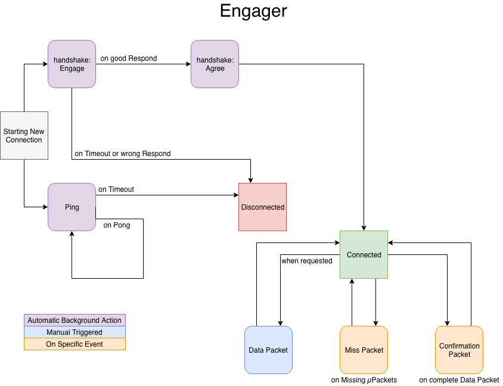
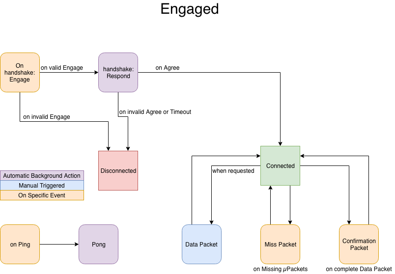

# Protocol

This document presents the protocol, how packets are exchange and what can be achieved with Etsedico.
This Protocol assumes that an UDP connection is achievable between the two peers. It should be handled before trying to
connect.

## Engager

## Engaged

